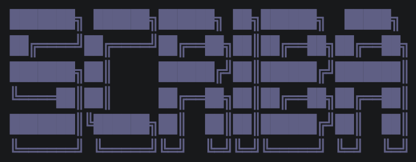
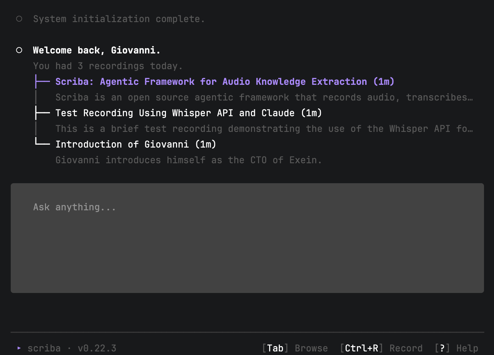
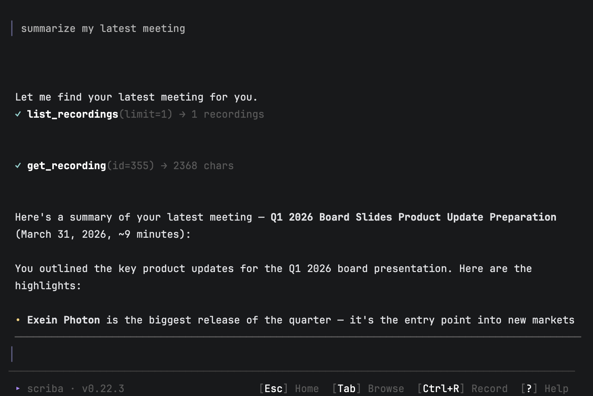

<div align="center">



**Record. Transcribe. Flow.**

[](LICENSE)

</div>

---

Scriba is an agent that turns your recordings into a searchable, queryable knowledge base and lets you ask questions across all of it. It builds a persistent knowledge graph so the agent always has context, not just the last thing you said.

Run entirely **offline** with local STT models (Parakeet, Whisper, SenseVoice) + Ollama, or bring your own **AI providers** (OpenAI, Anthropic, Google).

<div align="center">

</div>

## How it works

1. **Record** — capture your microphone or system audio
2. **Transcribe** — local STT models (Parakeet, Whisper, SenseVoice) or the OpenAI API
3. **Enrich** — an LLM extracts summaries, topics, entities, and action items from every recording
4. **Ask** — an agent reasons across your entire history to answer questions, find connections, and take action

## Get started

**Requirements:** FFmpeg and (optionally) Ollama for Private mode.

### macOS

```bash
brew install ffmpeg
brew tap giovannialberto/scriba
brew install scriba
```

### Linux

```bash
# Install dependencies (Debian/Ubuntu)
sudo apt install ffmpeg libasound2-dev

# Install scriba
curl -fsSL https://raw.githubusercontent.com/giovannialberto/scriba/main/install.sh | sh
```

For Fedora/RHEL: `sudo dnf install ffmpeg alsa-lib-devel`. For Arch: `sudo pacman -S ffmpeg alsa-lib`.

You can also grab a binary directly from [Releases](https://github.com/giovannialberto/scriba/releases).

### Run

```bash
scriba
```

On first run, Scriba walks you through an onboarding flow to choose your mode and configure your setup. Then **`Ctrl+R`** to record.


## Ask Scriba

Ask *"what did we decide in last Tuesday's call?"* or *"who has mentioned the Q2 roadmap?"* and Scriba will search your transcripts, look up entities, and chain tool calls to get to a real answer. Ask from the home to query your entire history, or from within a transcript for recording-specific context.

<div align="center">

</div>

## MCP server

Scriba exposes your recordings to Claude Desktop via the Model Context Protocol:

```json
{
  "mcpServers": {
    "scriba": { "command": "scriba", "args": ["mcp"] }
  }
}
```

Add to your Claude Desktop config:
- **macOS:** `~/Library/Application Support/Claude/claude_desktop_config.json`
- **Linux:** `~/.config/Claude/claude_desktop_config.json`

## License

[MIT](https://github.com/giovannialberto/scriba/blob/main/LICENSE) — Copyright (c) 2026 Giovanni Alberto Falcione
